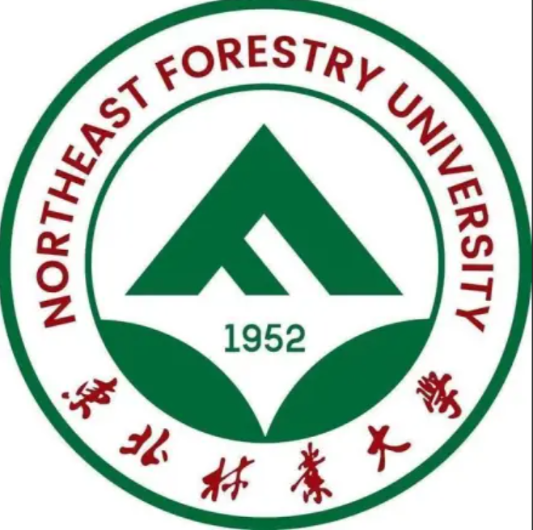

🎆 🎓 I obtained a Bachelor of Engineering degree in Communication Engineering from [Northeast Forestry University](https://www.nefu.edu.cn/). Now I am currently serving as a research assistant at the **EPIC Lab, Shanghai Jiao Tong University**, working under the mentorship of Prof. [Linfeng Zhang](https://scholar.google.com/citations?user=6tWunTgAAAAJ&hl=zh-CN). I am also fortunate to collaborate with Dr. [Siteng Huang](https://kyonhuang.top/) at **DAMO Academy** and Master’s student [Xuyang Liu](https://xuyang-liu16.github.io/) from **Sichuan University (SCU)**.

📌 **Research Interests:**  
- ⚡ *Efficient Large Model Inference* — accelerating multimodal LLMs and ViTs  
- 🧠 *DLLM* — RL-based optimization strategy
## 📳 News

* **2025.11.08**: 🎉🎉 Two papers have been accepted to **AAAI 2026**!  
  - *Compression with Global Guidance: Towards Training-free High-Resolution MLLMs Acceleration*  
  - *Filter, Correlate, Compress: Training-Free Token Reduction for MLLM Acceleration*  
  Congratulations to all collaborators!
* **2025.10.02**: 🎉 I have joined the EPIC Lab at Shanghai Jiao Tong University as a research assistant! I will be exploring acceleration strategies for diffusion-based large language models, including **remasking techniques** and **reinforcement-learning-driven optimization methods**. Looking forward to this exciting journey ahead!
* **2025.09.11**: 🎇🎇 We have released our latest work, [MAGPD](https://arxiv.org/abs/2501.05179), which proposes a multi-agent collaborative framework for instruction optimization! The project [Code](https://github.com/kawhiiiileo/MAPGD) is now available

* **2025.01.10**: 🎇🎇 We release our latest work [GlobalCom2](https://arxiv.org/abs/2501.05179), a "global-to-local" approach for training-free acceleration of **high-resolution MLLMs**. [Code](https://github.com/xuyang-liu16/GlobalCom2) is available!
 
* **2024.11.17**: 🚀🚀 We release our work [FiCoCo](https://ficoco-accelerate.github.io/) which proposes a **unified paradigm** to demystify the popular works and guide the future designs of training-free token reduction for MLLMs. 

## 📝 Publications 
Please find my full publications on my [Google Scholar](https://scholar.google.com/citations?user=I0V2KAEAAAAJ&hl=en) profile.  

<!---

-->

### Conference Papers
 Xuyang Liu, Ziming Wang, <u>Yuhang Han</u>, Yingyao Wang, Jiale Yuan, Jun Song, Bo Zheng, Linfeng Zhang, Siteng Huang, Honggang Chen &quot;**Compression with Global Guidance: Towards Training-free High-Resolution MLLMs Acceleration**&quot;. *Association for the Advancement of Artificial Intelligence*, 2025. (**CCF A**) [[paper](https://arxiv.org/pdf/2501.05179)] [[code](https://github.com/xuyang-liu16/GlobalCom2)] 

 <u>Yuhang Han</u>\*, Xuyang Liu\*, Pengxiang Ding, Donglin Wang, Honggang Chen, Qingsen Yan, Siteng Huang &quot;**Filter, Correlate, Compress: Training-Free Token Reduction for MLLM Acceleration**&quot;. *Association for the Advancement of Artificial Intelligence*, 2025. (**CCF A**) [[paper](https://arxiv.org/pdf/2411.17686)] [[page](https://ficoco-accelerate.github.io/)] [[code](https://github.com/kawhiiiileo/FiCoCo)] 

<!--  Junhong Li, Renxiang Guan, <u>Yuhang Han</u>, Yaowen Hu, Zihao Li, Yanyan Wu, Ziwei Xu, Xianju Li &quot;**Superpixel-based dual-neighborhood contrastive graph autoencoder for deep subspace clustering of hyperspectral image**&quot;. In *International Conference on Intelligent Computing (ICIC)*, 2024. (**CCF C**) [[paper](https://link.springer.com/chapter/10.1007/978-981-97-5597-4_16)] -->

### Journal Papers
<!---
 Xinying Lin, <u>Xuyang Liu</u>, Hong Yang, Xiaohai He, Honggang Chen, &quot;**Perception- and Fidelity-aware Reduced-Reference Super-Resolution Image Quality Assessment**&quot;. *IEEE Transactions on Broadcasting*, 2024. (**SCI Q1, IF: 3.2**) [[paper](https://arxiv.org/pdf/2405.09472)] [[code](https://github.com/xinyouu/PFIQA)] 

 <u>Xuyang Liu</u>, &quot;**GLMLP-TRANS: A transportation mode detection model using lightweight sensors integrated in smartphones**&quot;. *Computer Communications*, 2022. (**SCI Q1, IF: 6.0**) [[paper](https://www.sciencedirect.com/science/article/abs/pii/S0140366422002535)] [[code](https://github.com/xuyang-liu16/GLMLP-TRANS)] 
-->
 <u>Y Han</u>, B Duan, R Guan, G Yang, Z Zhen &quot;**LUFFD-YOLO: A Lightweight Model for UAV Remote Sensing Forest Fire Detection Based on Attention Mechanism and Multi-Level Feature Fusion**&quot;. *Remote sensing*, 2024. (**CAAI B & Q1**) [[paper](https://www.mdpi.com/2072-4292/16/12/2177)]

<!--  Yuqi Liu, Enshuo Zhu, Qinghe Wang, Junhong Li, Shujun Liu, Yaowen Hu, <u>Yuhang Han</u>, Renxiang Guan, Guoxiong Zhou &quot;**Spatial-Spectral Adaptive Graph Convolutional Subspace Clustering for Hyperspectral Image**&quot;. *IEEE Journal of Selected Topics in Applied Earth Observations and Remote Sensing*, 2024. (**CAAI B & Q1**) [[paper](https://ieeexplore.ieee.org/document/10757387)] -->

### Preprints & Under Submission
 Yichen Han\*, <u>Yuhang Han</u>\*, Bojun Liu, Zhengpeng Zhou, Zeng Zhang, Guanyu Liu, Yang Yang, Wenli Wang, Isaac N. Shi, Yunyan, Lewei He, Tianyu Shi &quot;**MAPGD: Multi-Agent Prompt Gradient Descent for Collaborative Prompt Optimization**&quot;. *arXiv preprint arXiv:2509.11361*. [[paper](https://arxiv.org/pdf/2509.11361)] [[code](https://github.com/kawhiiiileo/MAPGD)] 

## 💻 Experience
* Research Assistant — **EPIC Lab, Shanghai Jiao Tong University**, Shanghai  
  * Advisor: Prof. **Linfeng Zhang**  
  * Time: October 2025 – Present
  * Topic: *RL-based DLLM*
  * Research Output: To be announced — stay tuned!
* Research Assistant — **MiLab, Westlake University**, Hangzhou  
  * Advisors: Dr. **Siteng Huang**, Prof. **Donglin Wang**  
  * Time: Aug. 2024 – Dec. 2025  
  * Topic: *Efficient Multimodal Large Language Model*  
  * Research Output: [[FiCoCo](https://github.com/kawhiiiileo/FiCoCo)]

